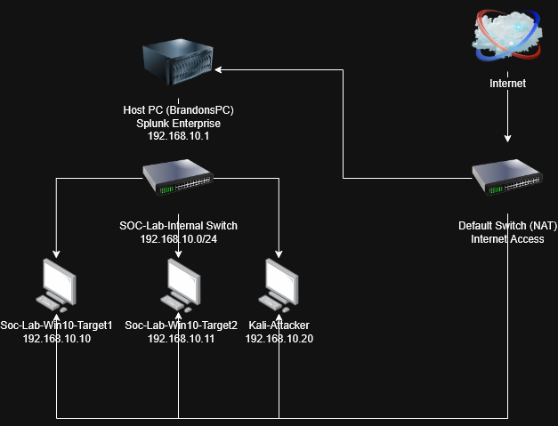
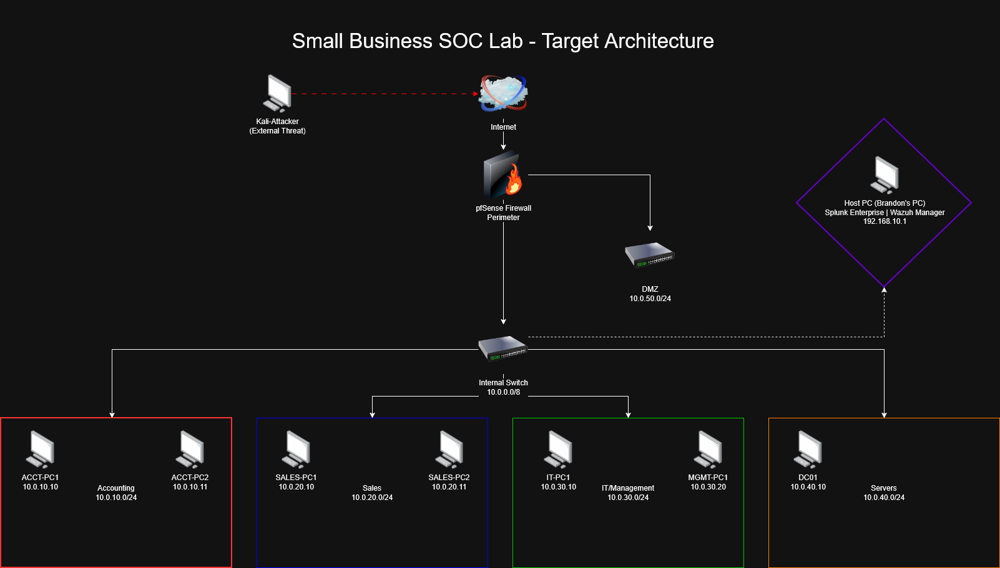

## Home SOC Lab - Splunk + Sysmon + Atomic Red Team
A home security operations center built to develop hands on incident response and threat hunting skills. This lab simulated real-world attack techniques and detects them using enteprise-grade tooling.

## Log Sources
| Source | Sourcetype | Description |
|--------|-----------|-------------|
| Windows Security Log | XmlWinEventLog | Authentication events, failed logins (source="XmlWinEventLog:Security")|
| Sysmon Operational | XmlWinEventLog | Process creation, network connections, file events |
| Windows Firewall Log | WindowsFirewallLog | Inbound/outbound connection records

**Note:** Both Sysmon and Windows Security Log events share the `XmlWinEventLog` sourcetype. 
Use `source="XmlWinEventLog:Security"` to filter Security log events and 
`source="XmlWinEventLog:Microsoft-Windows-Sysmon/Operational"` for Sysmon events.

## Alerts
- Inbound Port Scan Detection - Scheduled every 5 minutes
- Brute Force Attempt - Scheduled every 5 minutes
- Multi-Stage Attack Correlation - Scheduled every 5 minutes, 60 minute lookback window

## Detections Built
| Detection | MITRE Technique | SPL Search |
|-----------|----------------|------------|
| Inbound Port Scan Detection | T1046 | WindowsFirewallLog direction=RECEIVE count > 10 |
| Failed Login Brute Force | T1110 | EventCode=4625 |
| PowerShell Execution | T1059.001 | EventCode=1 CommandLine=*powershell* |
| Credential Dumping | T1003.001 | EventCode=1 Image=*dumpert* |
| System Discovery | T1082 | EventCode=1 |
| Multi-Stage Attack Correlation | T1046 + T1110.001 | Correlated port scans and brute force events from src_ip across WindowsFirewallLog and XmlWinEventLog |

## Correlation Searches

### Port Scan -> Brute Force Correlation
Detects a single source IP that appears in two separate sourcetypes within a 60 minute window. Indicates a multi-stage attack where an attacker had performed reconnaissance before attempting access.

```
index=main sourcetype="WindowsFirewallLog" earliest=-60m latest=now
| eval attacker_ip=src_ip
| union [search index=main sourcetype="XmlWinEventLog" source="XmlWinEventLog:Security" earliest=-60m latest=now | eval attacker_ip=IpAddress]
| stats dc(sourcetype) as source_count count by attacker_ip
| where source_count > 1
```


## Attack Simulations Run

### T1059.001 — PowerShell Execution
Simulated PowerShell-based execution using Atomic Red Team.
Detected via Sysmon EventCode 1 (Process Creation) in Splunk.

### T1003.001 — Credential Dumping (LSASS)
Simulated LSASS memory access using Outflank Dumpert technique.
Detected via Sysmon process creation events showing dumpert execution and whoami 
reconnaissance activity post-dump.

### T1082 — System Discovery
Simulated attacker reconnaissance including Griffon recon framework and Machine GUID 
enumeration. Detected via process creation logs showing discovery tool execution.

### T1046 — Network Port Scan
Ran nmap from Kali Linux against Windows VM. Detected via Windows Firewall log monitoring inbound RECEIVE connections exceeding threshold from single source IP.

### T1110.001 — RDP Brute Force
Ran Hydra from Kali Linux against RDP (Port 3389) using rockyou.txt wordlist. Detected via Security log EventCode 4625 failed login events exceeding threshold from single source IP. 

## Dashboard

Built a SOC Lab Dashboard in Splunk with three panels:
- Failed Logins — tracks authentication failures by user and host
- Process Creation — monitors all process spawning with full command lines
- Network Connections — tracks outbound connections by process and destination

## Incident Reports
| Report | Date | Summary |
|--------|------|---------|
| [IR-001 — Port Scan to RDP Access](incident-reports/IR-001_Port-Scan-to-RDP-Access_2026-06-24.pdf) | 2026-06-24 | Port scan → brute force → RDP access simulation and detection |

## Next Steps

- [ ] Simulate lateral movement T1021.001 (RDP lateral movement to a second target)
- [ ] Build a daily summary report (failed logins, top talkers)
- [x] Write full incident report chaining port scan → brute force → correlation
- [ ] Explore Caldera for automated adversary emulation

## Network Architecture

### Current Lab
<div align="center">



</div>

### Target Architecture

## Author

Brandon Wilkinson — Cybersecurity Student at MSU Denver | Cybersecurity Intern at ULA  
[CyberBrief Automation Project](https://github.com/itzbwilk/cyberbrief)


   
